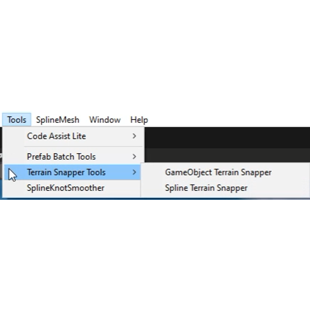

# Terrain Snapper Tools

[English](README.md) | [简体中文](README_CN.md)

一套简单实用的 Unity Editor 工具，用于将物体吸附对齐到 Terrain 表面。

这些工具可以快速把选中的 GameObject 或 Spline Knot 对齐到最近的 Terrain，免去在起伏地形上逐个手动调整 Y 坐标的重复操作。

## ✨ 功能特性

### GameObject Terrain Snapper

批量将选中的 GameObject 吸附到最近的 Terrain。

- 支持一次选中多个 GameObject
- 将每个物体的 Transform 位置吸附到 Terrain 表面高度
- 仅修改 Y 坐标，X 与 Z 保持不变
- 场景中存在多个 Terrain 分块时，自动选择最近的一块
- 支持 Unity Undo
- 在 Console 中报告被吸附的 GameObject 数量

### Spline Terrain Snapper

批量将 Spline Knot 吸附到最近的 Terrain。

- 支持一次选中一个或多个 Spline Container
- 将 Container 内每条 Spline 的每个 Knot 吸附到 Terrain 表面
- 仅修改 local Y 坐标，X 与 Z 保持不变
- 场景中存在多个 Terrain 分块时，自动选择最近的一块
- 吸附后的 local Y 会四舍五入保留 2 位小数
- 支持 Unity Undo
- 在 Console 中报告被吸附的 Knot 数量与处理的 Container 数量

## 📸 预览

*Tools 菜单*  


## 📦 安装

将脚本放入 Unity 工程中的 `Editor` 目录：

```text
Assets/
└── Editor/
    └── TerrainSnapperTools/
        ├── GameObjectTerrainSnapper.cs
        └── SplineTerrainSnapper.cs
```

`GameObjectTerrainSnapper` 无需任何额外依赖。`SplineTerrainSnapper` 需要 **Unity Splines 包**（`com.unity.splines`），可通过 **Window > Package Manager** 安装。

导入脚本后，工具会出现在 Unity Editor 菜单中：

```text
Tools
└── Terrain Snapper Tools
    ├── GameObject Terrain Snapper
    └── Spline Terrain Snapper
```

## 🕹️ 使用方法

1. 在 **Tools > Terrain Snapper Tools** 菜单中打开对应工具。
2. 在 **Hierarchy** 中选中一个或多个 GameObject（或 Spline Container）。
3. 确保场景中至少存在一个 Terrain。
4. 点击工具窗口中的吸附按钮。

## ↩️ Undo 支持

两个工具均支持 Unity 的 Undo 系统。

被吸附的 GameObject 与 Spline Knot 可以通过 `Ctrl + Z` 或 **Edit > Undo** 恢复。

## 🎯 使用场景

Terrain Snapper Tools 适用于：

- 关卡设计（Level Design）
- 场景环境搭建
- 场景整理
- 在起伏地形上摆放道具、植被或贴花
- 将用 Spline 绘制的道路、河流、围栏对齐到地面
- 快速修正悬空或陷入 Terrain 的物体
- 减少重复的手动 Transform 调整

## 📋 环境要求

- Unity 2022.3 或更高版本
- Unity Editor
- 场景中至少存在一个 Terrain
- Unity Splines 包（`com.unity.splines`）——仅 Spline Terrain Snapper 需要
- 仅 Editor 使用的工具

## ⚠️ 注意事项

- 这些工具面向 Unity Editor 工作流，应放置在 `Editor` 目录中。
- 工具作用于 Unity Hierarchy 中当前选中的 GameObject。
- 高度采样自 Terrain 的高度图，因此只会修改 Y 坐标，X 与 Z 不受影响。
- 当选中的物体或 Knot 不在任何 Terrain 范围内时，会使用最近的 Terrain 分块。
- 无需任何运行时组件。

## 📄 许可证

本项目基于 MIT 许可证开源，详见 [LICENSE](LICENSE) 文件。
